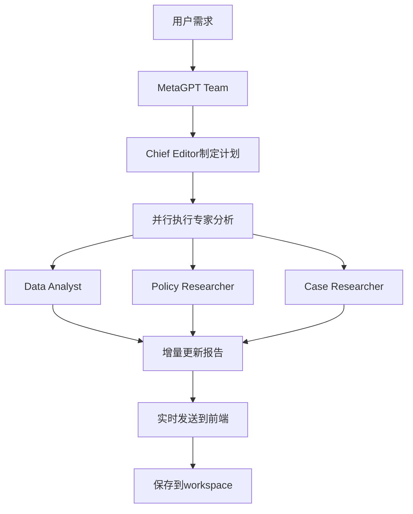

# AutoWriter Enhanced 设计文档

## 项目概述

AutoWriter Enhanced 是一个基于MetaGPT多Agent协作的智能报告生成系统，支持实时观察和交互。系统采用 FastAPI + React 架构，集成 MetaGPT 框架，实现动态报告生成和实时协作。

## 核心特性

- **多模式工作流**: 支持智能项目总监、迭代式SOP、传统SOP三种模式
- **MetaGPT多Agent协作**: 专业Agent团队协同工作
- **实时交互**: WebSocket实现实时通信
- **动态报告**: 基于需求动态生成报告结构
- **用户干预**: 支持实时插话和需求调整
- **三面板布局**: 报告列表、对话区域、报告预览
- **增量报告更新**: 实时更新报告内容到workspace

## 技术架构

### 后端架构 (Python)
- **FastAPI**: 高性能异步API框架
- **MetaGPT**: 多Agent协作框架
- **WebSocket**: 实时双向通信
- **SQLAlchemy**: 数据库ORM
- **异步处理**: 支持并发Agent执行

### 前端架构 (React/TypeScript)
- **React 18**: 现代React特性
- **TypeScript**: 类型安全
- **Zustand**: 轻量级状态管理
- **WebSocket**: 实时通信客户端
- **Tailwind CSS**: 样式框架

## 核心管理架构

### 智能管理器 (IntelligentManager)
统一的多Agent协作管理系统，支持三种工作模式：

1. **智能项目总监模式** - 真正的人机协同
2. **迭代式SOP模式** - 结构化迭代开发
3. **传统SOP模式** - 标准化工作流程

### 智能项目总监 (IntelligentProjectDirector)
**核心特性**：
- 动态模板生成和迭代调整
- 实时用户对话和需求收集
- 最小可行产品(MVP)理念
- 智能专家团队协调

**工作流程**：
```python
class ConversationPhase(Enum):
    GREETING = "greeting"                    # 问候阶段
    REQUIREMENT_COLLECTION = "requirement_collection"  # 需求收集
    TEMPLATE_PROPOSAL = "template_proposal"  # 模板提议
    TEMPLATE_CONFIRMATION = "template_confirmation"  # 模板确认
    CHAPTER_WRITING = "chapter_writing"      # 章节写作
    USER_FEEDBACK = "user_feedback"          # 用户反馈
    ITERATION = "iteration"                  # 迭代改进
    COMPLETION = "completion"                # 完成阶段
```

### Agent角色定义

1. **Data Analyst (数据分析师)**
   - 数据收集、统计分析和图表制作
   - 构建指标体系和量化分析

2. **Policy Researcher (政策研究员)**
   - 政策背景研究和政策建议
   - 合规性分析和法规依据

3. **Case Researcher (案例研究员)**
   - 案例收集和分析
   - 对比研究和最佳实践

4. **Indicator Expert (指标专家)**
   - 评价指标体系设计
   - 指标权重和评分标准

5. **Writer (写作专员)**
   - 文本写作和语言润色
   - 章节内容生成

6. **Reviewer (质量评审员)**
   - 内容审核和质量把控
   - 最终报告评审

### MetaGPT Team架构

```python
class ReportTeam(Team):
    """基于MetaGPT的报告团队"""
    
    def __init__(self, session_id: str, project_info: Dict, message_queue: Queue):
        super().__init__()
        self._session_id = session_id
        self._project_info = project_info
        self._message_queue = message_queue
        self._init_roles()
    
    def _init_roles(self):
        """初始化MetaGPT角色"""
        # 创建总编和专家角色
        # 使用MetaGPT的hire()方法雇佣角色
```

### Agent协作流程



## 实时交互设计

### WebSocket通信协议

#### 消息类型
- `agent_message`: Agent消息
- `user_intervention`: 用户插话
- `report_update`: 报告更新
- `workflow_status`: 工作流状态
- `thinking`: Agent思考状态

#### 消息格式
```json
{
  "type": "agent_message",
  "agent_type": "chief_editor",
  "agent_name": "总编",
  "content": "消息内容",
  "status": "thinking|completed|error",
  "timestamp": "2024-01-01T00:00:00Z"
}
```

### 用户干预机制

1. **实时插话**: 用户可随时发送消息
2. **总编响应**: 总编角色处理用户插话
3. **动态调整**: 根据插话调整工作重点
4. **反馈确认**: 系统确认收到用户指示

## 动态模板系统

### 智能模板规划器 (IntelligentTemplatePlanner)
```python
class IntelligentTemplatePlanner:
    """智能模板规划器 - 使用LLM分析用户需求并生成动态、可迭代的报告结构"""
    
    async def generate_template(self, user_input: str) -> DynamicTemplate:
        """使用LLM生成动态模板"""
        # 分析用户需求，生成最小可行产品(MVP)结构
        # 只包含2-3个最重要的核心章节
```

### 动态模板数据结构
```python
@dataclass
class DynamicTemplate:
    """动态模板 - 支持迭代和实时调整"""
    report_title: str
    report_type: str
    chapters: List[ChapterTask]
    current_chapter_index: int = 0
    user_requirements: List[str] = None
    reference_files: List[str] = None
    iteration_count: int = 1
    mvp_scope: str = "minimal"  # minimal, extended, full
    
    def to_yaml(self) -> str:
        """转换为YAML格式保存"""
    
    def expand_scope(self, new_requirements: List[str]):
        """扩展报告范围 - 支持从minimal到extended到full"""
```

### 章节任务管理
```python
@dataclass
class ChapterTask:
    """章节任务"""
    chapter_id: str
    title: str
    description: str
    assigned_experts: List[ExpertType]
    requirements: List[str]
    reference_materials: List[str]
    status: ChapterState = ChapterState.PLANNED
    draft_content: str = ""
    user_feedback: List[str] = None

class ChapterState(Enum):
    """章节状态"""
    PLANNED = "planned"          # 已规划
    IN_PROGRESS = "in_progress"  # 进行中
    DRAFT_READY = "draft_ready"  # 草稿完成
    USER_REVIEWING = "user_reviewing"  # 用户评审中
    APPROVED = "approved"        # 已批准
    NEEDS_REVISION = "needs_revision"  # 需要修订
```

## 报告生成系统

### 增量报告更新机制

```python
async def _simulate_expert_writing(self, chapter: ChapterTask):
    """模拟并执行专家写作过程，集成搜索和LLM"""
    # 1. 资料收集（搜索）
    search_results = await alibaba_search_tool.run(search_query)
    
    # 2. 调用LLM生成内容
    generated_content = await self._generate_chapter_content_with_llm(chapter, search_results)
    
    # 3. 保存到草稿文件
    draft_file_path = self.draft_path / f"{chapter.chapter_id}.md"
    with open(draft_file_path, "w", encoding="utf-8") as f:
        f.write(generated_content)
```

### Workspace管理

```
workspaces/
└── project_xxx/                    # 项目目录（自动递增）
    ├── draft/                      # 草稿文件夹
    │   ├── chapter_1.md           # 各章节草稿
    │   └── chapter_2.md
    ├── files/                      # 用户上传文件
    ├── dynamic_template.yaml       # 动态生成的模板
    └── report.md                   # 最终完整报告
```

### 实时预览更新

- **增量更新**: Agent完成分析后立即更新报告
- **文件保存**: 保存到workspace目录
- **实时同步**: 前端实时显示报告变化
- **版本管理**: 支持模板和内容的版本控制

## MetaGPT集成架构

### 配置管理
```python
# MetaGPT配置通过config2.yaml
def _configure_metagpt(self):
    """配置MetaGPT"""
    from metagpt.config2 import config
    
    if hasattr(config, 'llm') and config.llm:
        logger.info(f"✅ MetaGPT配置成功: {config.llm.model}")
        logger.info(f"   API类型: {config.llm.api_type}")
        logger.info(f"   API地址: {config.llm.base_url}")
```

### LLM调用
```python
# 智能项目总监中的LLM调用
class IntelligentProjectDirector(Role):
    def __init__(self, session_id: str, project_name: str, message_queue: Queue):
        super().__init__(name="智能项目总监", ...)
        
        # 确保LLM正确初始化
        if not hasattr(self, 'llm') or not self.llm:
            from metagpt.provider.llm import LLM
            self.llm = LLM()
    
    async def _generate_chapter_content_with_llm(self, chapter: ChapterTask, search_results: str) -> str:
        """使用LLM生成章节内容"""
        content = await self.llm.aask(prompt)
        return content
```

### 多模式管理架构
```python
class IntelligentManager:
    """智能管理器 - 统一的多Agent协作管理"""
    
    async def start_intelligent_workflow(self, session_id: str, websocket_manager):
        """启动智能项目总监工作流程"""
        
    async def start_iterative_workflow(self, session_id: str, websocket_manager):
        """启动迭代式工作流程"""
        
    async def start_sop_workflow(self, session_id: str, project_info: Dict, websocket_manager):
        """启动SOP工作流程"""
```

## 数据流设计

### 会话管理
```python
class MetaGPTManager:
    active_sessions: Dict[str, Dict]
    message_queues: Dict[str, Queue]
    teams: Dict[str, ReportTeam]
```

### 消息流
1. **用户消息** → WebSocket → MetaGPTManager
2. **Agent分析** → 消息队列 → WebSocket → 前端
3. **报告更新** → workspace文件 → 前端预览

## 部署架构

### 开发环境
```bash
# 启动后端 (包含MetaGPT)
python start_backend.py

# 启动前端
cd frontend && npm run dev
```

### 依赖管理
```txt
# requirements.txt - 精简版依赖
fastapi==0.104.1
uvicorn[standard]==0.24.0
websockets==11.0.3
metagpt==1.0.0
# ... 其他核心依赖
```

## API设计

### REST API
- `POST /api/sessions` - 创建会话
- `GET /api/sessions` - 获取会话列表

### WebSocket API
- `/ws/{session_id}` - 会话WebSocket连接

## 核心文件结构

```
autowriter/
├── backend/
│   ├── main.py                         # FastAPI应用入口
│   ├── models/
│   │   └── session.py                  # 会话模型
│   ├── services/
│   │   ├── intelligent_manager.py      # 🔥 智能管理器 (统一入口)
│   │   ├── intelligent_director.py     # 🔥 智能项目总监 (核心)
│   │   ├── metagpt_manager.py          # MetaGPT传统管理器
│   │   ├── metagpt_sop_manager.py      # SOP工作流管理器
│   │   ├── iterative_sop_manager.py    # 迭代式SOP管理器
│   │   └── websocket_manager.py        # WebSocket管理
│   └── tools/
│       ├── alibaba_search.py           # 阿里巴巴搜索工具
│       └── report_template_analyzer.py # 报告模板分析器
├── frontend/
│   └── src/
│       ├── components/
│       │   ├── Chat/                   # 聊天组件
│       │   └── Layout/                 # 布局组件
│       ├── hooks/
│       │   └── useWebSocket.ts         # WebSocket钩子
│       ├── pages/
│       │   └── HomePage.tsx            # 主页
│       └── stores/
│           └── reportStore.ts          # 报告状态管理
├── workspaces/                         # 报告工作空间
│   └── project_xxx/                    # 项目目录
│       ├── draft/                      # 草稿文件夹
│       ├── files/                      # 上传文件夹
│       ├── dynamic_template.yaml       # 动态模板
│       └── report.md                   # 最终报告
├── MetaGPT/                           # MetaGPT源码
├── local-db/                          # 本地数据库
├── reportmodel.yaml                   # 报告模型配置
└── requirements.txt                   # Python依赖
```

## 性能优化

- **异步处理**: 全面使用async/await
- **消息队列**: 高效的消息传递
- **增量更新**: 避免重复生成整个报告
- **WebSocket**: 实时通信减少轮询

## 扩展性设计

- **插件化Agent**: 基于MetaGPT Role系统
- **多模型支持**: 支持不同LLM模型
- **模板系统**: 支持多种报告模板
- **云部署**: 支持容器化部署

## 监控和日志

- **MetaGPT日志**: 集成MetaGPT的日志系统
- **结构化日志**: 使用结构化日志格式
- **性能监控**: Agent执行时间监控
- **错误追踪**: 完整的错误追踪

## 测试策略

- **MetaGPT集成测试**: 测试Agent协作
- **WebSocket测试**: 实时通信测试
- **报告生成测试**: 端到端报告生成
- **用户交互测试**: 插话和响应测试