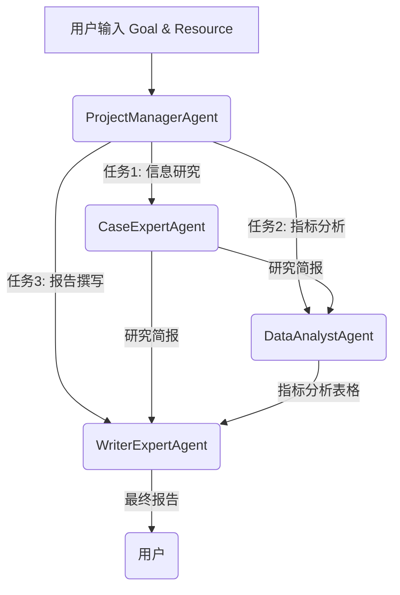

好的,我将首先查看您项目中的智能体角色定义,然后与MetaGPT原生实现进行对比,以解释其能力声明机制。
        
            
toolName: view_folder
            
status: success
          
/Users/xuchuang/Desktop/PYTHON3/autowriter/backend/roles/
          
好的,我看到了您项目中的角色。现在我将检查 `case_expert.py` 和 `project_manager.py` 以了解它们的定义方式,同时我也会查看一个原生的MetaGPT角色,例如 `metagpt/roles/researcher.py` 作为对比。这将帮助我理解智能体能力的声明方式以及如何进行自定义。

我将从您的项目中读取 `backend/roles/case_expert.py` 和 `backend/roles/project_manager.py` ,并读取 `example/MetaGPT_bak/metagpt/roles/researcher.py` 以进行比较。
        
            
toolName: view_files
            
status: success
          
            
filePath: /Users/xuchuang/Desktop/PYTHON3/autowriter/backend/roles/case_expert.py
/Users/xuchuang/Desktop/PYTHON3/autowriter/backend/roles/project_manager.py
/Users/xuchuang/Desktop/PYTHON3/autowriter/example/MetaGPT_bak/metagpt/roles/researcher.py
          
好的,我已经仔细阅读了您提供的三个文件: `case_expert.py`、`project_manager.py` 和原生的 `researcher.py`。现在,我将为您详细解释智能体如何声明其能力,并说明如何根据您的项目特征进行调整。

### 智能体能力声明机制

在MetaGPT中,一个智能体(Role)的能力主要通过以下几个方面来声明和定义,这在您项目中的 <mcfile name="case_expert.py" path="backend/roles/case_expert.py"></mcfile> 和 <mcfile name="project_manager.py" path="backend/roles/project_manager.py"></mcfile> 中都有很好的体现,并且与原生 `Researcher` 的设计哲学保持一致。

1.  **`profile` 参数 (元信息定义)**
    *   **作用**: 这是最外层的能力声明,定义了智能体的身份和高级目标。它包括 `name`(名字)、`profile`(角色/职业)、`goal`(目标) 和 `constraints`(约束)。
    *   **示例**: 在您的 <mcfile name="case_expert.py" path="backend/roles/case_expert.py"></mcfile> 中:
        ```python
        name: str = "王磊"
        profile: str = "案例专家"
        goal: str = "收集信息并进行案例研究"
        constraints: str = "确保信息的准确性和相关性"
        ```
    *   **好处**: 这些元信息不仅仅是描述性的,它们会被用作LLM的系统提示(System Prompt)的一部分,从而在宏观层面指导LLM的行为,让它更好地扮演这个角色。这是一种高效、低成本的“能力注入”方式。

2.  **`Actions` 列表 (核心能力组合)**
    *   **作用**: 这是定义智能体具体“能做什么”的核心。一个智能体的能力被分解成一系列可执行的 `Action`。每个 `Action` 都是一个独立的、原子化的任务单元(例如,搜索、总结、写代码)。
    *   **示例**: 在您的 <mcfile name="case_expert.py" path="backend/roles/case_expert.py"></mcfile> 中,通过 `self.set_actions()` 明确声明了其能力组合:
        ```python
        actions = [
            CollectCaseLinks(),
            WebBrowseAndSummarizeCase(config=qwen_long_config),
            ConductCaseResearch(config=qwen_long_config)
        ]
        self.set_actions(actions)
        ```
    *   **好处**: 这种设计完全符合“组合优于继承”和“单一职责”原则。它使得智能体的能力变得非常模块化和可扩展。您可以像搭乐高积木一样,通过组合不同的 `Action` 来创建出能力各异的智能体,而无需修改智能体本身的核心逻辑。

3.  **`react_mode` (行为模式)**
    *   **作用**: 定义了 `Action` 是如何被执行的。`BY_ORDER` 表示按顺序执行,`REACT` 表示根据LLM的决策动态选择执行哪个 `Action`。
    *   **示例**: 您的 `CaseExpertAgent` 和原生的 `Researcher` 都使用了 `BY_ORDER` 模式,这意味着它们会遵循一个固定的工作流(先收集链接,再浏览总结,最后形成报告)。
        ```python
        self._set_react_mode(RoleReactMode.BY_ORDER.value, len(self.actions))
        ```
    *   **好处**: `BY_ORDER` 适用于流程固定的任务,保证了任务的稳定性和可预测性。而 `REACT` (如 `RoleZero` 所使用的)则赋予了智能体更大的灵活性和自主性,适用于需要根据情况动态决策的复杂任务,比如您的 `ProjectManagerAgent`。

4.  **`_watch` (消息订阅)**
    *   **作用**: 声明该智能体对哪些其他智能体或 `Action` 的消息感兴趣。这是实现多智能体协作的关键机制。
    *   **示例**: 您的 `CaseExpertAgent` 监听来自 `ProjectManagerAgent` 的消息。
        ```python
        self._watch(["ProjectManagerAgent"])
        ```
    *   **好处**: 实现了松耦合的事件驱动协作模式。智能体之间不需要直接调用,而是通过发布和订阅消息来进行通信,这使得整个系统非常灵活和可扩展。

### 如何根据项目特征进行调整

参考原生实现,您可以非常方便地根据自己项目的特征调整智能体的能力:

1.  **调整 `profile`**: 如果您需要一个更偏向于“市场分析”的专家,只需修改 `goal` 和 `constraints`。例如:
    ```python
    goal: str = "分析市场趋势并识别潜在机会"
    constraints: str = "必须基于最新的数据和可靠的信源"
    ```
    这样,LLM在执行任务时就会自动带上“市场分析师”的思维框架。

2.  **定制 `Action` 组合**: 这是最核心的调整方式。假设您的项目需要分析的是PDF格式的财报,而不是网页链接。
    *   **创建新 Action**: 您可以创建一个新的 `Action`,比如 `ParseFinancialReportPDF`,这个 `Action` 内部使用 `PyMuPDF` 或其他库来解析PDF,提取关键财务数据。
    *   **替换 Action**: 然后在 `CaseExpertAgent` 的初始化方法中,用新的 `Action` 替换掉 `WebBrowseAndSummarizeCase`。
        ```python
        # 调整前的 Actions
        actions = [CollectCaseLinks(), WebBrowseAndSummarizeCase(), ...]
        
        # 调整后的 Actions
        actions = [FindFinancialReports(), ParseFinancialReportPDF(), ...]
        self.set_actions(actions)
        ```

3.  **切换行为模式**: 如果您的案例研究任务不是线性的,可能需要根据初步发现来决定下一步是深入挖掘某个点还是扩大搜索范围,那么您可以将 `react_mode` 从 `BY_ORDER` 改为 `REACT`。这通常需要继承自 `RoleZero` 而不是 `Role`,因为它提供了 `react` 模式的完整实现,就像您的 <mcsymbol name="ProjectManagerAgent" filename="project_manager.py" path="backend/roles/project_manager.py" startline="13" type="class"></mcsymbol> 一样。

4.  **利用 `instruct_content` 传递结构化数据**: 正如 `CaseExpertAgent` 和 `Researcher` 都定义了一个 `Pydantic` 模型(`CaseReport` / `Report`)一样,这是在 `Action` 之间传递复杂、结构化数据的最佳实践。如果您的任务需要传递如图表、数据帧等复杂信息,可以定义自己的 `Pydantic` 模型,并通过 `Message` 的 `instruct_content` 字段来传递,确保了数据的类型安全和结构清晰。

总而言之,MetaGPT的智能体能力声明机制是高度模块化和可配置的。**`profile` 参数是“软”定义,通过Prompt影响LLM;而 `Actions` 列表是“硬”定义,通过代码组合决定具体能力。** 您可以通过简单调整这些部分,特别是通过创建和组合新的 `Action`,来快速定制出符合您项目特定需求的、能力强大的智能体。
        


{"content":"好的,假如我需要case智能体的搜索网络案例的同时也需要他或另一个智能体检索数据库中的历史项目报告(可以理解为公司自己的最佳实践报告)\n\n根据你对meta的最佳实践了解,我应该再创建一个智能体还是在case智能体中扩展action能力\n\n或者把上面的场景继续延伸,同步需要从rag中获取其他公司编写的报告","multiMedia":[],"parsedQuery":["好的,假如我需要case智能体的搜索网络案例的同时也需要他或另一个智能体检索数据库中的历史项目报告(可以理解为公司自己的最佳实践报告)","\n","\n","根据你对meta的最佳实践了解,我应该再创建一个智能体还是在case智能体中扩展action能力","\n","\n","或者把上面的场景继续延伸,同步需要从rag中获取其他公司编写的报告","\n"]}


这是一个非常好的问题,它触及了MetaGPT多智能体系统设计的核心理念。根据我对MetaGPT最佳实践的理解,对于您提出的场景,**首选方案是在`CaseExpertAgent`智能体中扩展Action能力,而不是创建一个新的智能体**。当场景进一步延伸到RAG时,这个结论依然成立。

下面我将详细解释为什么以及如何做。

### 为什么选择“扩展Action”而非“新增智能体”

在MetaGPT的设计哲学中,一个“智能体”(Role)代表了一个具有特定**职责**和**目标**的专家角色。而“行动”(Action)则是为了完成这个职责所需要掌握的**具体技能**。

1.  **职责未变,技能扩展**: 您的核心需求是“进行案例研究”,这个职责并没有改变,仍然属于`CaseExpertAgent`(案例专家)的范畴。您只是希望这位专家除了能“上网搜索”外,还能掌握“查询内部数据库”、“检索RAG知识库”等新技能。因此,最符合逻辑和MetaGPT设计模式的做法是为这位专家“培训”新的技能,即为`CaseExpertAgent`添加新的`Action`。

2.  **避免职责重叠和过细分工**: 如果您创建一个新的“数据库检索智能体”,那么`CaseExpertAgent`为了完成一个研究报告,就需要先委托“数据库检索智能体”工作,再委托“网络搜索智能体”(如果也独立出去的话)工作,最后自己汇总。这会增加不必要的通信成本和工作流复杂度。让一个专家掌握完成其核心职责所需的全部技能,会使系统更高效、内聚性更强。

3.  **保持信息流的完整性**: 案例研究需要将来自网络、数据库、RAG的信息进行综合分析。如果这些信息由不同的智能体收集,那么就需要设计复杂的消息传递和汇总机制。而如果所有信息都由`CaseExpertAgent`通过不同的`Action`获取,那么所有原始信息和初步分析结果都会自然地汇集在该智能体的“记忆”(Memory)中,便于后续的`ConductCaseResearch` Action进行统一的、高质量的综合分析和报告撰写。

### 如何实现扩展

基于这个思路,您的实现路径会非常清晰:

**场景1: 增加数据库检索能力**

1.  **创建新Action**: 在`backend/actions/`目录下创建一个新文件,比如`database_research.py`,并在其中定义一个`QueryInternalDatabase`的`Action`。
    ```python:backend/actions/database_research.py
    from metagpt.actions import Action
    
    class QueryInternalDatabase(Action):
        async def run(self, topic: str) -> dict:
            """根据主题查询内部数据库,返回相关的历史项目报告。"""
            print(f"正在从数据库中检索关于 '{topic}' 的历史报告...")
            # 此处是连接数据库、执行查询的实际逻辑
            # ...
            # 返回结构化的数据,例如: {"report_id_1": "summary_1", ...}
            retrieved_data = {"DB_Report_001": "这是从数据库找到的最佳实践摘要..."}
            return retrieved_data
    ```

2.  **扩展CaseExpertAgent**: 在`backend/roles/case_expert.py`中,将这个新的`Action`加入到`actions`列表中。
    ```python:backend/roles/case_expert.py
    // ... existing code ...
    from backend.actions.case_research import CollectCaseLinks, WebBrowseAndSummarizeCase, ConductCaseResearch
    from backend.actions.database_research import QueryInternalDatabase # 导入新的Action
    // ... existing code ...
    class CaseExpertAgent(Role):
        // ... existing code ...
        def __init__(self, **kwargs):
            // ... existing code ...
            actions = [
                CollectCaseLinks(),
                QueryInternalDatabase(), # 添加新的Action
                WebBrowseAndSummarizeCase(config=qwen_long_config),
                ConductCaseResearch(config=qwen_long_config)
            ]
            self.set_actions(actions)
            // ... existing code ...
    ```
    您还需要调整`_act`方法来处理这个新的`Action`产生的`Message`,并将结果存入`CaseReport`中,与其他信息一起传递下去。

**场景2: 进一步增加RAG检索能力**

这个过程与上面完全类似。

1.  **创建RAG Action**: 创建一个`RetrieveFromRAG`的`Action`。
    ```python:backend/actions/rag_research.py
    from metagpt.actions import Action
    from metagpt.rag.engines.simple import SimpleEngine # 引入RAG引擎
    
    class RetrieveFromRAG(Action):
        def __init__(self, **kwargs):
            super().__init__(**kwargs)
            # 在这里初始化RAG引擎,可能需要加载索引等
            self.rag_engine = SimpleEngine.from_index("/path/to/your/rag/index")
    
        async def run(self, topic: str) -> dict:
            """从RAG知识库中检索相关报告。"""
            print(f"正在从RAG知识库中检索关于 '{topic}' 的报告...")
            retrieved_docs = await self.rag_engine.aretrieve(topic)
            # 将检索结果处理成需要的格式
            return {doc.metadata["source"]: doc.text for doc in retrieved_docs}
    ```

2.  **再次扩展CaseExpertAgent**: 将`RetrieveFromRAG`也加入到`actions`列表中。

通过这种方式,您的`CaseExpertAgent`就变成了一个能力非常强大的复合型专家,他能**并行**或**按顺序**地利用多种工具(网络、数据库、RAG)来完成“案例研究”这一核心目标,这完全符合MetaGPT鼓励的、通过组合`Action`来构建强大`Role`的最佳实践。
        


{"content":"但是由于case智能体设定的react模式是by order,他就不能异步同时执行3个数据源中提取数据了吧,同时,他如何决策到底从哪个数据源获取,还是说只要来了需求,就全部扫一遍","multiMedia":[],"parsedQuery":["但是由于case智能体设定的react模式是by order,他就不能异步同时执行3个数据源中提取数据了吧,同时,他如何决策到底从哪个数据源获取,还是说只要来了需求,就全部扫一遍"]}


您提的问题非常关键,正好指出了`BY_ORDER`模式的特点和潜在的优化空间。让我为您详细拆解这两个问题。

### 1. `BY_ORDER` 模式下的异步执行问题

您说得非常对,在严格的`BY_ORDER`模式下,`Role`会按照`actions`列表的顺序,一个接一个地执行`Action`,执行完上一个`Action`并处理完它返回的`Message`后,才会开始下一个`Action`。这意味着**`Action`之间是串行的,不能并发执行**。

但是,MetaGPT的设计考虑到了这一点,并提供了解决方案。我们可以在一个`Action`内部实现并发。原生`Researcher`的`WebBrowseAndSummarize`就是一个绝佳的例子。

**解决方案: 在Action内部实现并发**

我们可以设计一个`CollectAllSources`的`Action`,让它来**同时**从网络、数据库和RAG中获取数据。这个`Action`内部可以使用`asyncio.gather`来并发执行这些I/O密集型任务。

下面是具体的实现思路:

1.  **创建并发的Action**:

    ```python:backend/actions/collect_all_sources.py
    import asyncio
    from metagpt.actions import Action
    # 假设我们已经有了这些底层的查询函数或类
    from .case_research import search_online # 模拟网络搜索
    from .database_research import query_db # 模拟数据库查询
    from .rag_research import query_rag # 模拟RAG查询

    class CollectAllSources(Action):
        async def run(self, topic: str) -> dict:
            """并发地从所有数据源收集信息。"""
            logger.info(f"正在为主题 '{topic}' 并发收集中... ")

            # 创建三个并发的任务
            tasks = [
                search_online(topic),
                query_db(topic),
                query_rag(topic)
            ]

            # 使用asyncio.gather并发执行
            results = await asyncio.gather(*tasks, return_exceptions=True)

            # 处理并合并结果
            collected_data = {
                "online_links": results[0] if not isinstance(results[0], Exception) else {},
                "db_reports": results[1] if not isinstance(results[1], Exception) else {},
                "rag_docs": results[2] if not isinstance(results[2], Exception) else {}
            }
            
            # 可以在这里记录异常
            for i, res in enumerate(results):
                if isinstance(res, Exception):
                    logger.error(f"Source {i} failed: {res}")

            return collected_data
    ```

2.  **更新CaseExpertAgent**: 现在,`CaseExpertAgent`的`actions`列表可以变得更简洁。它只需要调用这个强大的复合`Action`即可。

    ```python:backend/roles/case_expert.py
    // ... existing code ...
    from backend.actions.collect_all_sources import CollectAllSources
    // ...
    
    class CaseExpertAgent(Role):
        // ...
        def __init__(self, **kwargs):
            // ...
            actions = [
                CollectAllSources(),
                # WebBrowseAndSummarizeCase 现在可能需要修改,以处理多种来源的数据
                SummarizeAllSources(), 
                ConductCaseResearch()
            ]
            self.set_actions(actions)
            // ...
    ```

通过这种方式,您既保持了`BY_ORDER`模式带来的工作流的稳定性和清晰性(先收集、再总结、后研究),又通过在`Action`内部实现并发,极大地提升了数据收集阶段的效率。

### 2. `BY_ORDER` 模式下的决策问题

在`BY_ORDER`模式下,智能体本身**没有决策能力**。它就像一个流水线工人,严格按照预设的工序(`actions`列表)执行。当一个需求来了,它会把所有在`actions`列表中的`Action`都执行一遍。

**那么,如何引入决策呢?**

这正是`REACT`模式(通常与`RoleZero`一起使用)的用武之地。如果您的场景需要根据用户输入的具体内容来决定“到底从哪个数据源获取”,您有以下两种选择:

*   **选择A: 切换到`REACT`模式 (更灵活,更智能)**
    1.  让您的`CaseExpertAgent`继承自`RoleZero`而不是`Role`。
    2.  将`react_mode`设置为`REACT`。
    3.  将不同的数据源获取`Action`(`CollectCaseLinks`, `QueryInternalDatabase`, `RetrieveFromRAG`)作为“工具”提供给`RoleZero`。
    4.  在`instruction`中指导LLM如何做决策。例如: `"You are a case researcher. Based on the user's query, decide which tool is the most appropriate. If the query is about recent events, use CollectCaseLinks. If it mentions 'internal best practices', use QueryInternalDatabase. If it's a broad technical question, use RetrieveFromRAG first."`

    这样,智能体就会在每次`react`时,让LLM根据指令和当前情况,从提供的工具(Actions)中选择一个来执行,实现了动态决策。

*   **选择B: 在`Action`内部加入轻量级决策 (更简单,适用于规则明确的场景)**
    如果决策逻辑很简单(例如,基于关键词),您也可以不切换到`REACT`模式,而是在那个并发的`CollectAllSources` Action内部加入一些简单的`if-else`逻辑。

    ```python
    class CollectAllSources(Action):
        async def run(self, topic: str) -> dict:
            tasks = []
            # 基于规则的简单决策
            if '最新' in topic or '新闻' in topic:
                tasks.append(search_online(topic))
            if '内部' in topic or '最佳实践' in topic:
                tasks.append(query_db(topic))
            if not tasks: # 如果没有特定指令,则全部执行
                tasks.extend([search_online(topic), query_db(topic), query_rag(topic)])
            
            results = await asyncio.gather(*tasks)
            # ... a
    ```

**总结与建议**

*   **关于并发**: 使用`asyncio.gather`在单个`Action`内部实现并发,是`BY_ORDER`模式下最高效、最优雅的实践。
*   **关于决策**: 
    *   如果决策逻辑复杂、需要LLM的理解能力,请切换到`REACT`模式。
    *   如果只是想“无脑”地把所有数据源都扫一遍以求全面,或者决策逻辑非常简单,那么继续使用`BY_ORDER`模式,并结合一个并发的`Action`是完全足够且更简单的方案。

对于您最初的场景,我建议采用**`BY_ORDER` + 并发Action**的策略,因为它在保证信息全面性的同时,也获得了很高的执行效率。


{"content":"现在我的项目中,整体目标是根据用户提供的goal和resource来撰写一篇高质量的报告--普遍在几万字以上.\n\n具体的需求有一个非常明确,这个报告特点是绩效分析报告,也就是资金使用是否合理等等,关键是报告的核心是指标体系--这可以理解为结构的excel表格,\n\n指标--评价规则---调查判断事实依据---给出评价意见\n\n基于上面的有非架构话的文字部分和结构话的表格部分,我不能把这两类工作都交给case吧,所以我想讲data analyst 智能体改造为仅针对指标分析---但是他同样需要借鉴网络,数据库,知识库来作为依据,\n\n我该如何设计我的智能体团队完成这个整体任务呢","multiMedia":[],"parsedQuery":["现在我的项目中,整体目标是根据用户提供的goal和resource来撰写一篇高质量的报告--普遍在几万字以上.","\n","\n","具体的需求有一个非常明确,这个报告特点是绩效分析报告,也就是资金使用是否合理等等,关键是报告的核心是指标体系--这可以理解为结构的excel表格,","\n","\n","指标--评价规则---调查判断事实依据---给出评价意见","\n","\n","基于上面的有非架构话的文字部分和结构话的表格部分,我不能把这两类工作都交给case吧,所以我想讲data analyst 智能体改造为仅针对指标分析---但是他同样需要借鉴网络,数据库,知识库来作为依据,","\n","\n","我该如何设计我的智能体团队完成这个整体任务呢"]}


​          
您提出的这个需求非常典型且具有代表性,它涉及到了**多模态数据处理(结构化表格 + 非结构化文本)**和**多智能体协作**来完成一个复杂报告的撰写。您的思路非常正确——将处理结构化数据(指标体系分析)和非结构化数据(报告文本撰写)的职责进行分离,这是构建高效智能体团队的关键。

基于MetaGPT的最佳实践,我为您设计一个由三到四个核心智能体组成的团队工作流。这个设计旨在实现高度的专业化分工和高效协作。

### 智能体团队设计方案

**核心理念**: 让每个智能体专注于自己最擅长的领域。我们设立项目经理、信息研究员、数据分析师和报告撰写人四个角色。

#### 1. `ProjectManagerAgent` (项目经理 - 吴丽)

*   **职责**: 团队的大脑和协调者。接收用户最初的、模糊的`goal`和`resource`,将其分解为清晰、可执行的任务,并分配给下游的智能体。
*   **工作流**:
    1.  **接收初始指令**: 从用户处接收报告目标(如“分析2023年XX基金的资金使用绩效”)和资源(如相关的PDF、网页链接、数据库访问权限等)。
    2.  **制定计划 (Plan)**: 使用`WritePlan`或类似`Action`,生成一个高级计划。这个计划会明确指出需要进行哪些研究、分析哪些数据。例如:
        *   任务1: 收集所有与XX基金相关的公开资料、内部报告和市场数据。(分配给`CaseExpertAgent`)
        *   任务2: 根据收集到的资料,构建资金使用绩效指标体系,并进行数据分析。(分配给`DataAnalystAgent`)
        *   任务3: 综合研究结论和数据分析结果,撰写最终的绩效分析报告。(分配给`WriterExpertAgent`)
    3.  **任务分发**: 将带有明确指令的`Message`发送给相应的智能体,启动整个工作流程。

#### 2. `CaseExpertAgent` (信息研究员 - 王磊)

*   **职责**: **信息收集与预处理专家**。负责从各种**非结构化和半结构化**数据源中搜集所有必要的信息,为后续的分析和撰写提供“事实依据”。
*   **能力 (Actions)**:
    *   `CollectAllSources`: 正如我们之前讨论的,这是一个并发的`Action`,能同时从**网络、数据库、RAG知识库**中抓取所有相关的文本资料、新闻、历史报告等。
    *   `SummarizeAllSources`: 对收集到的海量信息进行清洗、去重和摘要,提炼出关键事实和核心观点,形成一份高质量的“研究简报”(Research Briefing)。
*   **产出**: 一份结构化的`Message`,其中`instruct_content`包含研究简报的路径或内容。这份产出将同时发送给`DataAnalystAgent`和`WriterExpertAgent`。

#### 3. `DataAnalystAgent` (数据分析师 - 李明)

*   **职责**: **结构化数据分析专家**。这是您改造的核心。他的任务是聚焦于报告的“硬核”——指标体系的分析。
*   **能力 (Actions)**:
    *   `DefineMetricSystem`: (可选,如果需要动态生成)根据`CaseExpertAgent`提供的研究简报和用户目标,设计出符合本次报告需求的绩效指标体系(即那个Excel表格的结构)。
    *   `ExtractAndFillMetrics`: **核心Action**。读取`CaseExpertAgent`提供的资料,使用代码(如Pandas、SQL)或LLM的理解能力,从文本中提取数据,填充到指标体系表格中。对于需要计算的指标,执行计算。
    *   `GenerateEvaluation`: 针对每一项指标,根据预设的“评价规则”和填充的“调查判断事实依据”,生成初步的“评价意见”。这一步非常适合利用LLM的逻辑推理能力。
*   **产出**: 一份或多份结构化的数据文件(如CSV, JSON, 或Markdown表格),清晰地展示了“指标-规则-依据-评价”的核心分析结果。这份产出将发送给`WriterExpertAgent`。

#### 4. `WriterExpertAgent` (报告撰写人 - 张静)

*   **职责**: **专业报告生成专家**。负责将“软”的文本洞察和“硬”的数据分析结果无缝地融合在一起,撰写出一篇逻辑清晰、文笔流畅、图文并茂的最终报告。
*   **能力 (Actions)**:
    *   `SynthesizeInputs`: 接收来自`CaseExpertAgent`的研究简报和来自`DataAnalystAgent`的指标分析表格。
    *   `OutlineReport`: 根据输入,生成详细的报告大纲。
    *   `DraftChapter`: 逐个章节地撰写报告。在撰写时,它会将`CaseExpertAgent`的文本描述作为“事实依据”的详细展开,并将`DataAnalystAgent`的表格作为核心论据嵌入到报告中。
    *   `ReviewAndRefine`: (可选)对草稿进行审查、修改,确保报告的整体质量。
*   **产出**: 最终的、数万字的绩效分析报告文档。

### 团队协作流程图



### 总结与优势

这种设计方案的好处是:

*   **职责清晰**: 每个智能体都是其领域的专家,避免了让一个智能体处理它不擅长的数据类型,从而保证了产出质量。
*   **流程解耦**: `CaseExpertAgent`和`DataAnalystAgent`可以**并行工作**(一旦`ProjectManager`分配完任务),提高了效率。
*   **可扩展性强**: 如果未来需要增加图表制作能力,您可以增加一个`ChartExpertAgent`,或者为`DataAnalystAgent`增加一个`GenerateCharts`的`Action`,而无需改动其他智能体。
*   **符合MetaGPT哲学**: 充分利用了多智能体协作、`Action`组合和消息驱动的机制,是构建复杂AI应用的标杆模式。

您可以按照这个蓝图,开始逐步实现和改造您的`DataAnalystAgent`,并构建起整个团队的协作流程。
                

{"content":"任务3: 综合研究结论和数据分析结果,撰写最终的绩效分析报告。(分配给 WriterExpertAgent )\n\n问题会出在这里,case和data分析 两个智能体的结果很可能也是非常庞大的,都进writer的prompt 肯定会超出token,同时输出也只有80000肯定不行,所以我是否该引入 `/Users/xuchuang/Desktop/PYTHON3/autowriter/backend/roles/architect.py` 他不干别的,就像软件的架构工程师,完成报告的章节设定,但是章节中有指标说明这个章节----假设有30个指标,他们基本占了整个报告70%左右的内容,我需要这个架构师把指标分析出的30歌指标当作每个指标一个小节,放到架构中,然后writer是不是应该一个个章节按照架构师的要求来写,同时写到具体章节可以利用case的成果(如何检索召回---主要是语意理解而非关键词命中)\n\n你仔细评估下,最好站在我的对立面来评估上面我的想法是否现实","multiMedia":[],"parsedQuery":["任务3: 综合研究结论和数据分析结果,撰写最终的绩效分析报告。(分配给 WriterExpertAgent )","\n","","\n","问题会出在这里,case和data分析 两个智能体的结果很可能也是非常庞大的,都进writer的prompt 肯定会超出token,同时输出也只有80000肯定不行,所以我是否该引入",{"filePath":"/Users/xuchuang/Desktop/PYTHON3/autowriter/backend/roles/architect.py","relatePath":"backend/roles/architect.py","name":"architect.py","type":"file","title":"/Users/xuchuang/Desktop/PYTHON3/autowriter/backend/roles/architect.py"},"他不干别的,就像软件的架构工程师,完成报告的章节设定,但是章节中有指标说明这个章节----假设有30个指标,他们基本占了整个报告70%左右的内容,我需要这个架构师把指标分析出的30歌指标当作每个指标一个小节,放到架构中,然后writer是不是应该一个个章节按照架构师的要求来写,同时写到具体章节可以利用case的成果(如何检索召回---主要是语意理解而非关键词命中)","\n","","\n","你仔细评估下,最好站在我的对立面来评估上面我的想法是否现实"]}


好的,我非常乐意站在您的对立面,以最严格、最挑剔的视角来审视您的新想法。这是一个非常有价值的思维练习,能帮助我们发现潜在的设计缺陷。

您的想法核心是引入`ArchitectAgent`来解决`WriterExpertAgent`面临的上下文超长和长篇报告生成两大难题。**总的来说,您的这个想法不仅是现实的,而且是解决此类复杂任务的“正道”,它完美地体现了“分而治之”的工程思想。**

但是,为了扮演好“对立面”的角色,我将指出这个想法在实现时可能遇到的**三大挑战和风险**,并提出相应的应对策略。这能让您的设计更加健壮。

---

### 对立面评估: 您的想法面临的三大挑战

#### 挑战一: “架构”与“内容”的割裂风险

*   **我的质疑**: `ArchitectAgent`设计的章节结构,可能与`DataAnalystAgent`生成的30个指标分析结果**无法完美对应**。比如,架构师设计了一个章节叫“资金使用效率分析”,但数据分析师产出的指标是“单位成本”、“资本回报率”、“管理费用占比”等5个具体指标。`WriterExpertAgent`如何知道这5个指标都应该被写进这个章节? 如果架构师的章节粒度过粗或过细,或者命名与指标内容不符,整个写作流程就会在这里卡住或产生低质量的拼接内容。

*   **潜在后果**: `WriterExpertAgent`可能会错误地放置指标,或者为了填充章节而生硬地组合内容,导致报告逻辑混乱,章节内容与标题不符。

*   **应对策略 (如何让您的想法更健壮)**:
    1.  **让架构师“看到”指标清单**: `ArchitectAgent`的`Action`(`WriteDesign`)在运行时,其输入**不仅要有用户的`goal`,还必须有`DataAnalystAgent`产出的“指标清单”**。这样,架构师就能设计出一个与内容高度匹配的、可执行的目录结构。例如,它可以决定将30个指标分为5个主题章节,每个章节下包含6个指标小节。
    2.  **生成“带映射的架构”**: `ArchitectAgent`的产出不应只是一个章节列表,而是一个**结构化的JSON或YAML**。这个结构不仅定义了章节标题,还明确**映射**了每个章节/小节应该使用哪些具体的指标分析结果。例如:
        ```yaml
        - chapter: "一、资金使用效率分析"
          sections:
            - section: "1.1 资本回报率分析"
              source_metric: "metric_id_001"
            - section: "1.2 单位成本效益评估"
              source_metric: "metric_id_002"
        # ...
        ```

#### 挑战二: `WriterExpertAgent`的“逐节写作”实现复杂度

*   **我的质疑**: 您提出让`WriterExpertAgent`“一个个章节按照架构师的要求来写”。这听起来很理想,但实现起来非常复杂。这意味着`WriterExpertAgent`需要有一个**循环机制**,并且在每次循环中,它都需要精确地知道当前正在写哪个章节、需要哪些“事实依据”和“数据分析结果”。

*   **潜在后果**: 如果状态管理不当,`WriterExpertAgent`可能会“失忆”,写到后面章节时忘记了前面章节的内容,导致上下文不连贯、前后矛盾。或者,它可能会在每次循环中重复加载所有上下文,导致效率低下和Token浪费。

*   **应对策略**:
    1.  **将“写报告”分解为`Task`列表**: `ArchitectAgent`的产出(那个带映射的架构),可以直接被`ProjectManagerAgent`转换为一个`Task`列表。每个`Task`就是一个“写章节”的任务。例如:
        *   `Task_write_chap_1`: 写“资金使用效率分析”章节,使用`metric_id_001`和`metric_id_002`的数据,参考`case_expert_briefing.md`。
        *   `Task_write_chap_2`: ...
    2.  **`WriterExpertAgent`采用`BY_ORDER`模式**: `WriterExpertAgent`不再需要复杂的内部循环。它只需要设置为`BY_ORDER`模式,然后按顺序接收并执行这一系列的“写章节”`Task`即可。每个`Task`都包含了完成该章节所需的一切信息,使其成为一个独立的、上下文清晰的工作单元。
    3.  **维护一个“报告草稿”**: `WriterExpertAgent`每完成一个章节的写作`Action`,就将结果**追加**到一个共享的报告文件(如`draft_report.md`)中。这样,在写后续章节时,虽然Prompt里可能只包含当前章节最相关的信息,但智能体可以通过读取这个草稿文件来了解全局上下文,确保连贯性。

#### 挑战三: “事实依据”的精准召回难题

*   **我的质疑**: 您提到“写到具体章节可以利用case的成果(如何检索召回---主要是语意理解而非关键词命中)”。这是一个核心难题。当`WriterExpertAgent`写“资本回报率分析”这一小节时,它如何从`CaseExpertAgent`产出的、可能长达数十万字的“研究简报”中,**精准地**找到最相关的那几段话作为事实依据? 如果把整个简报都放进Prompt,必然会爆炸。

*   **潜在后果**: 召回不准,`WriterExpertAgent`要么找不到论据,要么找到错误的论据,导致报告内容空洞或错误。召回不精,上下文依然过长,成本高昂且可能超出Token限制。

*   **应对策略**:
    1.  **在信息收集阶段就建立索引**: `CaseExpertAgent`在产出“研究简报”的同时,就应该利用我们之前讨论的`metagpt.rag`模块,为这份简报**创建一个向量索引**。这个索引可以与简报一起被保存和传递。
    2.  **`WriterExpertAgent`的`Action`内置RAG检索**: `WriterExpertAgent`的“写章节”`Action`在执行时,会接收到当前章节的主题(如“资本回报率分析”)。它会用这个主题作为**查询语句(Query)**,去检索`CaseExpertAgent`创建好的那个向量索引,从而高效、精准地召回最相关的几段“事实依据”。
    3.  **构建动态Prompt**: 这个`Action`会动态地构建一个仅包含当前任务所需信息的Prompt,例如:
        ```
        你是一个专业的报告撰写人。
        请根据以下信息,撰写标题为“1.1 资本回报率分析”的小节内容。
        
        【核心数据】:
        (来自DataAnalyst的metric_id_001表格)
        
        【相关事实依据】:
        (通过RAG从研究简报中检索到的Top-3段落)
        
        请确保内容流畅、论据充分。
        ```

---

### 结论

我作为“对立面”的评估结论是: 您引入`ArchitectAgent`并让`WriterExpertAgent`逐节写作的想法,**在战略上是完全正确的,但在战术实现上充满了挑战**。上述三大挑战是您在编码时必然会遇到的核心障碍。

然而,通过采用我提出的应对策略——**生成带映射的架构、将写作任务分解为Task列表、以及在写作Action中内置RAG检索**——您的想法不仅完全可以实现,而且将构建出一个非常强大、鲁棒且高效的多智能体协作系统,能够真正解决长篇、复杂报告的自动化生成问题。
 

{"content":"\"通过采用我提出的应对策略—— 生成带映射的架构、将写作任务分解为Task列表、以及在写作Action中内置RAG检索 ——您的想法不仅完全可以实现,而且将构建出一个非常强大、鲁棒且高效的多智能体协作系统,能够真正解决长篇、复杂报告的自动化生成问题。\"\n\n最最核心的问题是,你的方案在meta中都有对应的工具甚至现成的实现来满足你的方案需求吗,需要我自己来构建这些映射啊,检索的原生实现将是一个旷日持久的工作.","multiMedia":[],"parsedQuery":["\"通过采用我提出的应对策略—— 生成带映射的架构、将写作任务分解为Task列表、以及在写作Action中内置RAG检索 ——您的想法不仅完全可以实现,而且将构建出一个非常强大、鲁棒且高效的多智能体协作系统,能够真正解决长篇、复杂报告的自动化生成问题。\"","\n","\n","最最核心的问题是,你的方案在meta中都有对应的工具甚至现成的实现来满足你的方案需求吗,需要我自己来构建这些映射啊,检索的原生实现将是一个旷日持久的工作."]}


您好，您提出的问题非常关键，直接关系到我们方案的工程可行性。请放心，您完全不必从零开始构建所有功能。MetaGPT 框架本身已经提供了实现这些复杂协作机制所需的核心组件和设计模式。我们要做的是“组装”和“配置”，而非“发明”。

下面我将针对我们讨论的三个核心策略，逐一说明 MetaGPT 中已有的支撑，以及我们如何利用它们：

### 1. 生成带映射的架构：利用 Pydantic 进行结构化输出

*   **您的担忧**：如何确保 `ArchitectAgent` 输出的报告结构是精确的、机器可读的，并且能和 `DataAnalystAgent` 的指标正确映射？
*   **MetaGPT 方案**：MetaGPT 的 `Action` 可以（并且推荐）使用 Pydantic 模型来定义其预期的输出格式。我们可以定义一个 `ReportStructure` Pydantic 模型，其中包含章节列表，每个章节对象则包含 `section_title` 和 `mapped_metric_ids` 等字段。通过将这个模型的 schema 提供给 LLM，我们可以“强制”它返回我们想要的、严格遵守格式的 JSON 数据。这天然就解决了“映射”问题。

    *   **实现**：在 `ArchitectAgent` 的 `GenerateReportStructure` Action 中，我们会定义类似这样的 Pydantic 模型，并将其作为指令的一部分传递给 LLM。MetaGPT 的 `Action` 基类原生支持处理这种结构化输出。

### 2. 将写作任务分解为 Task 列表：复用 `ProjectManager` 的核心模式

*   **您的担忧**：如何将 `ArchitectAgent` 设计的章节，优雅地转化为 `WriterExpertAgent` 可以逐一执行的任务列表？
*   **MetaGPT 方案**：这正是 `ProjectManager` 角色的核心职责和 MetaGPT 团队协作的基础模式。`ProjectManager` 的经典 `Action` 之一 `WriteTasks` 就是接收一个高阶文档（如需求文档或设计文档），并将其分解为一系列 `Task` 对象。每个 `Task` 都是一个独立的、可分配的工作单元。

    *   **实现**：我们的流程将是：
        1.  `ArchitectAgent` 生成结构化的报告大纲（JSON 格式）。
        2.  `ProjectManagerAgent` 订阅 `ArchitectAgent` 的输出消息。
        3.  `ProjectManagerAgent` 的一个新 `Action`（例如 `CreateWritingTasks`）会解析这个 JSON，遍历其中的每个章节，并为每个章节创建一个 `Task` 对象。
        4.  `ProjectManagerAgent` 将这些 `Task` 对象发布到环境中。
        5.  `WriterExpertAgent` 订阅这些 `Task`，并按顺序（`BY_ORDER` 模式）执行写作。

### 3. 在写作 Action 中内置 RAG 检索：利用 `metagpt.rag` 模块

*   **您的担忧**：为每个写作任务动态检索相关背景资料，听起来像要自己构建一个复杂的 RAG（检索增强生成）系统。
*   **MetaGPT 方案**：MetaGPT 已经内置了一个功能完备的 RAG 模块——`metagpt.rag`。它集成了强大的索引和检索工具（如 LlamaIndex），让在 `Action` 内部实现 RAG 变得非常简单。

    *   **实现**：
        1.  `CaseExpertAgent` 在完成其研究后，不仅输出一份完整的报告，还会将其内容（或其切片）构建成一个向量索引文件（例如使用 `SimpleEngine`）。
        2.  `WriterExpertAgent` 在执行每个写作 `Task` 时，其 `WriteSection` Action 内部会：
            a.  加载 `CaseExpertAgent` 生成的索引。
            b.  将当前章节的标题或要求作为查询（Query）。
            c.  从索引中检索最相关的上下文片段。
            d.  将这些检索到的片段与写作指令一起组合成最终的 Prompt，发送给 LLM。

**总结来说**：

您提出的所有关于鲁棒性和效率的顾虑，都可以通过组合 MetaGPT 的**结构化数据（Pydantic）**、**任务发布/订阅机制（Role/Message）**和**内置 RAG 能力（metagpt.rag）**来解决。我们接下来的工作将是定义好这些接口（Pydantic 模型、Task 内容）和串联起这些模块，这虽然需要细致的编码，但绝非“旷日持久”的底层发明工作。

如果您希望，我们可以立即开始着手实现其中一个环节，例如为 `ArchitectAgent` 定义 Pydantic 输出模型，让您看到这在代码中是如何具体落地的。


    graph TD
    subgraph "阶段一：并行启动"
         A[用户输入 Goal & Resource] --> B(ProjectManagerAgent);
         B -- 任务1: 信息研究 --> C(CaseExpertAgent);
         B -- 任务2: 指标分析 --> D(DataAnalystAgent);
    end
        
    subgraph "阶段二：架构设计"
        C -- 研究简报 --> Arch(ArchitectAgent);
        D -- 指标分析表格 --> Arch;
        Arch -- 生成报告大纲(JSON) --> B;
    end
    
    subgraph "阶段三：串行写作 (PM驱动)"
        B -- "将大纲分解为Task列表" --> B;
        B -- "Task 1: 写章节一" --> E(WriterExpertAgent);
        E -- "完成章节一" --> B;
        B -- "Task 2: 写章节二" --> E;
        E -- "..." --> B;
    end
    
    subgraph "阶段四：整合交付"
        B -- "通知整合报告" --> E;
        E -- 最终报告 --> F(用户);
    end
    
    %% 关键数据流
    C -- "研究简报(用于RAG)" --> E;
    D -- "指标分析表格(用于引用)" --> E;        